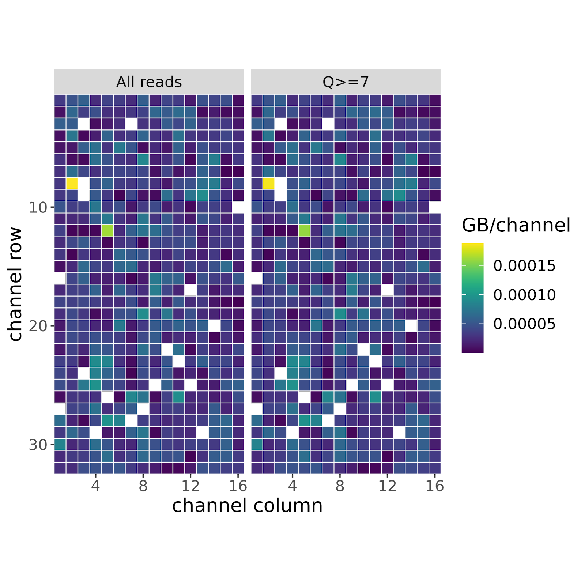
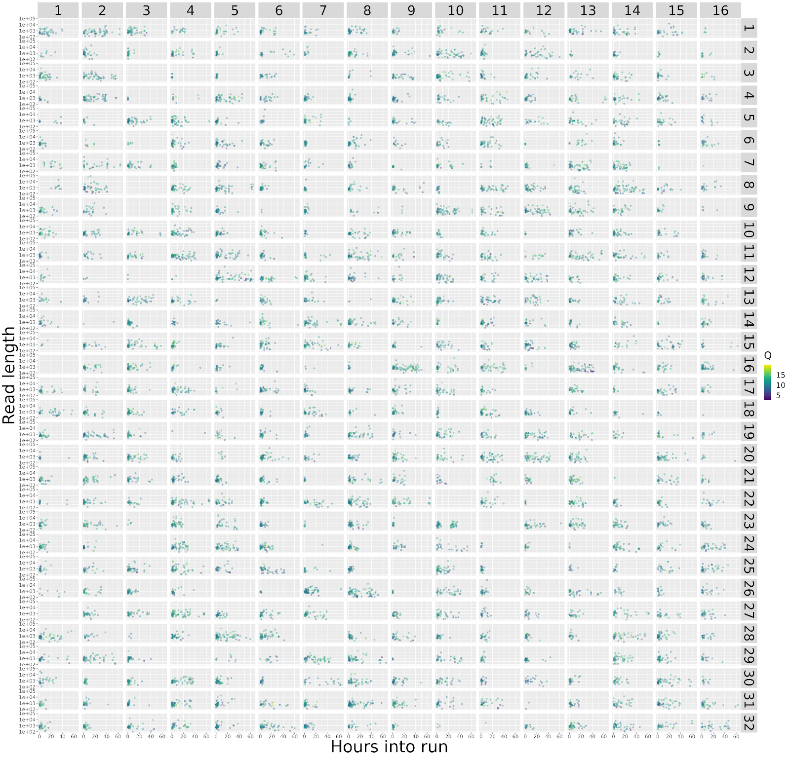
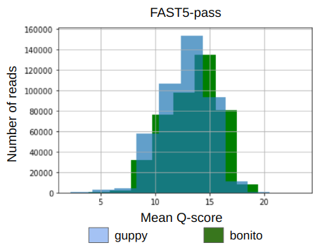

# BI_Listeria_project
Authors: 
- Tarbeeva Svetlana
- Kozlova Anna

### Introduction
*Listeria monocytogenes* is a pathogenic bacterium commonly found in food processing environments, particularly in meat production facilities. Its ability to form biofilms on various surfaces poses a significant risk for food contamination and subsequent foodborne illnesses. To better understand the factors contributing to biofilm growth and the development of resistance, the application of advanced sequencing technologies such as Oxford Nanopore Technologies (ONT) sequencing has emerged as a valuable tool. 

### Aim, tasks and data
In this study, we aimed to investigate the growth of biofilms containing *Listeria monocytogenes*. We obtained ONT sequencing data from meat and poultry processing plants (barcode Lm_137), as well as panoramic MS (Mass Spectrometry) analysis data. The data were provided by [Institute of Biomedical Chemistry](https://www.ibmc.msk.ru/). These biofilms were previously treated with disinfectants based on Quaternary Ammonium Compounds, acetic acid, and chlorine. Our goal was to determine why the biofilms developed in unexpected areas and identify the determinants of their resistance.

### Workflow
The workflow of the project presented at the following scheme. Each part of scheme will be discussed below.

Initially, the ONT sequencing files were converted from FAST5 to FASTQ format using [guppy basecaller](https://timkahlke.github.io/LongRead_tutorials/BS_G.html) software. 
```
guppy_basecaller -i ~/Lm_137/pass/ -s ~/Lm_137/guppy_res_pass_137 --flowcell FLO-MIN106 --kit SQK-RBK004 --device auto
```
To evaluate the quality of the sequencing data, standard quality assessment protocols were planned, but were unfortunately not performed initially. 
Several genome assemblers, including [wtdbg2](https://github.com/ruanjue/wtdbg2), [flye](https://github.com/fenderglass/Flye) and [raven](https://github.com/lbcb-sci/raven), were tested, and their results were compared using the [QUAST](https://github.com/ablab/quast) tool.

```
(1)
./wtdbg2 -x rs -g 3m -i lm_big137.fq.gz -t 16 -fo assembl_lm_137
./wtpoa-cns -t 16 -i assembl_lm_137.ctg.lay.gz -fo assembl_lm_137.raw.fa

(2)
flye --nano-raw lm_big137.fq.gz --out-dir ~/meat

(3)
raven lm_big137.fq.gz > raven_Ls137.fa
```
The following values were obtained:

|                          | wtdbg2  | raven   | flye    |
|--------------------------|---------|---------|---------|
| number of contigs        | 3       | 6       | 3       |
| largest contig           | 3006065 | 1573255 | 3015572 |
| total length             | 3078949 | 3134447 | 3083511 |
| N50                      | 3006065 | 1573255 | 3015572 |
| L50                      | 1       | 1       | 1       |
| predicted genes (unique) | 1096    | 1374    | 1102    |

Based on these parameters, raven appears to perform the best overall. The assembly was then annotated using [Prokka](https://github.com/tseemann/prokka):

```
prokka --outdir prokka --compliant --centre centre --gcode 11 --evalue 1e-04 --genus Listeria --species Listeria_monocytogenes --quiet raven_Ls137.fa
```
Subsequently, tools such as DefensFinder and ResFinder were intended to be used; however, they did not yield any significant findings. ResFinder identified only the fosX gene associated with fosfomycin resistance, but it was not associated with the disinfectants used in our study. This raised concerns, leading us to step back and perform quality assessment of the sequencing data using [MinIONQC](https://github.com/roblanf/minion_qc).

```
Rscript ./MinIONQC.R  -i sequencing_summary.txt -o ~/meat/Lm_137_pass_minionqc_results 
```

It was discovered that the sequencing data had very low quality, as indicated by the abnormal blue color on the quality assessment graph.



Considering these issues, an alternative approach was pursued. The [Bonito basecaller](https://github.com/nanoporetech/bonito) was tested and showed slightly improved read quality:


```
bonito basecaller dna_r9.4.1_e8_fast@v3.4 pass > 137p_bonito_basecalled.fastq
```
```
raven 137p_bonito_basecalled.fastq > raven_bonito_p137.fa -t4
```

```
barrnap prokka/PROKKA_05132023.fna > output.gff3
bedtools getfasta -fi prokka/PROKKA_05132023.fna -bed output.gff3 -name -s -fo 16S.fasta
```
Defence finder and ResFinder == 0

Download [reference genome](https://www.ncbi.nlm.nih.gov/genome/159?genome_assembly_id=159660). 

```
minimap2 -ax map-ont /home/fox/ngmlr-0.2.7/lm_reference.fasta /home/fox/work1/Lm_137/137p_bonito_basecalled.fastq > output.sam
```

```
samtools view -bS output.sam > 137p_bonito.bam
samtools sort 137p_bonito.bam -o 137p_bonito.sorted.bam
samtools flagstat 137p_bonito.sorted.bam > bon137_flag.txt
```

```
462955 + 0 in total (QC-passed reads + QC-failed reads)
15425 + 0 secondary
15664 + 0 supplementary
0 + 0 duplicates
419298 + 0 mapped (90.57% : N/A)
```

```
bcftools mpileup -Ou -f /home/fox/ngmlr-0.2.7/lm_reference.fasta 137p_bonito.sorted.bam | bcftools call -mv -Ov -o 137bon_output.vcf
```

DeepVariant
```
INPUT_DIR="${PWD}"
OUTPUT_DIR="${PWD}/137p-output"
mkdir -p "${OUTPUT_DIR}"

sudo docker run \
-v "${INPUT_DIR}":"/input" \
-v "${OUTPUT_DIR}":"/output" \
google/deepvariant:"${BIN_VERSION}" \
/opt/deepvariant/bin/run_deepvariant \
—model_type=WGS \
—ref=/input/lm_reference.fasta \
—reads=/input/137p_bonito.sorted.bam \
—output_vcf=/output/p137_bon.vcf.gz \
—output_gvcf=/output/p137_bon.g.vcf.gz \
—intermediate_results_dir /output/intermediate_results_dir \
—num_shards=4
```

VarScan 

```
varscan mpileup2snp 137p_bonito.mpileup —min-var-freq 0.5 —variants —output-vcf 1 > VarScan_bon137.vcf
```

```
java -jar pilon-1.24.jar —genome lm_reference.fasta —vcf —vcfqe —tracks —nanopore 137p_bonito.sorted.bam
```


### Results

### Conclusion and further plans
In conclusion, we learned an important lesson about the necessity of conducting quality control measures at the beginning of any sequencing project. Despite the challenges faced during this study, our research has helped us to better master the tools for ONT data processing: for example, we found a slight advantage of the bonito basecoller when it comes to the quality of reads.  We also compared several genome assemblers and in our case the raven performed better.
Further improvements in reed quality with nanopolish are in the pipeline. If we find significant genes associated with disinfection resistance, we also plan to search for their proteins in the MS data using the MaxQuant tool. 


### Literature
